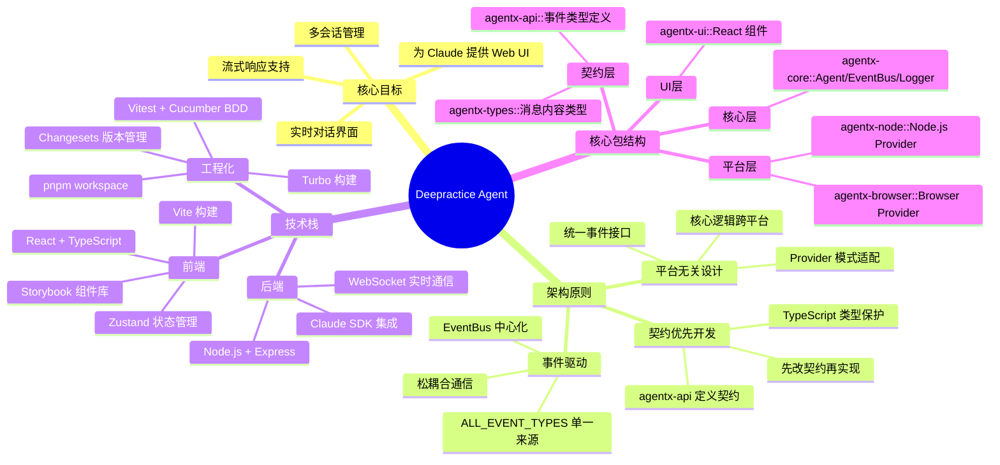
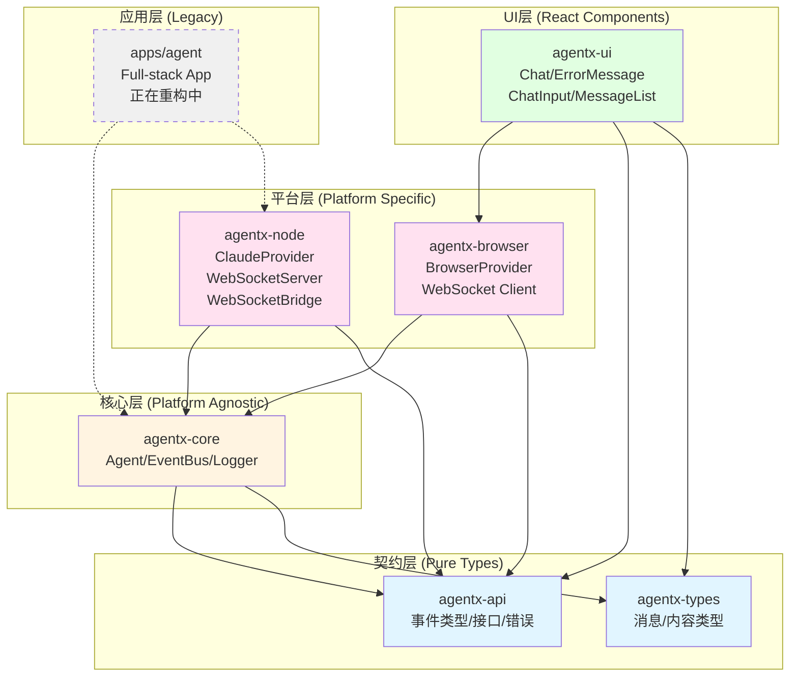
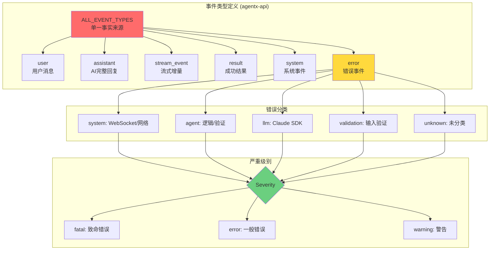
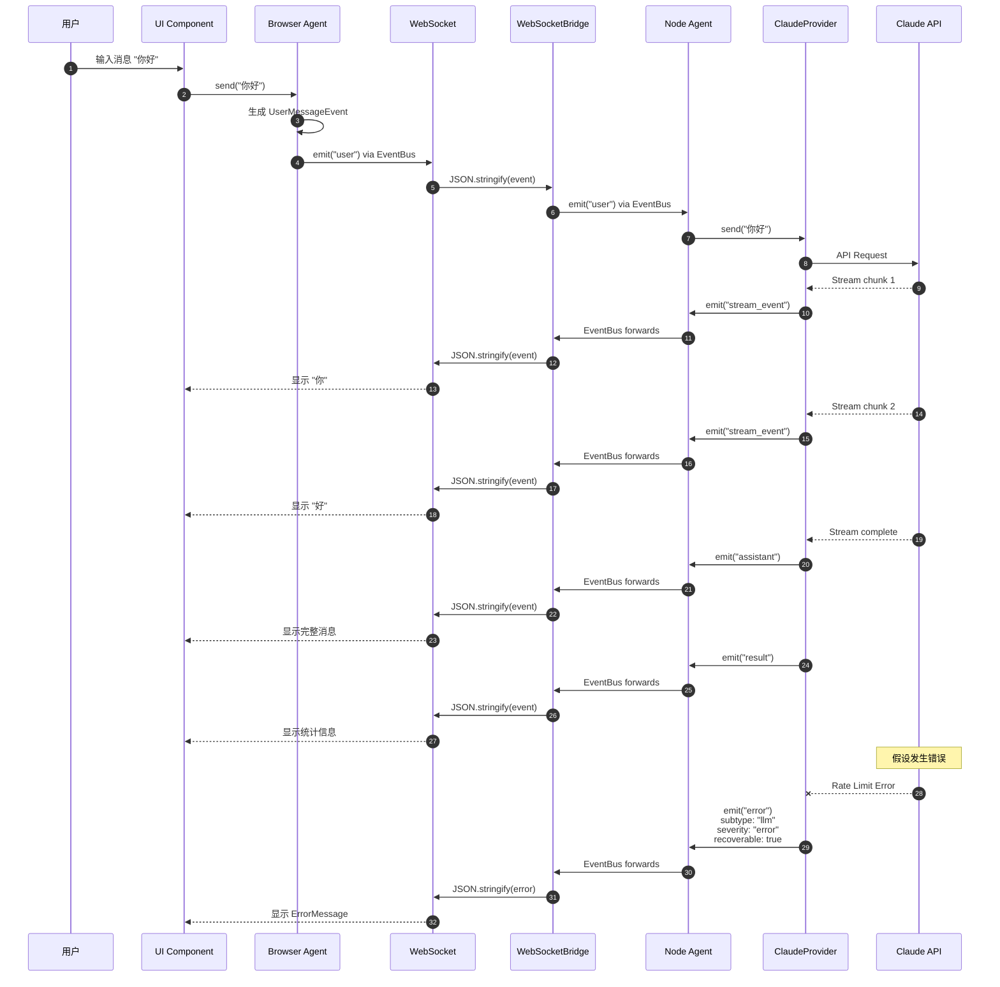
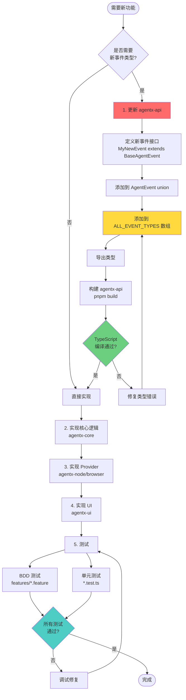
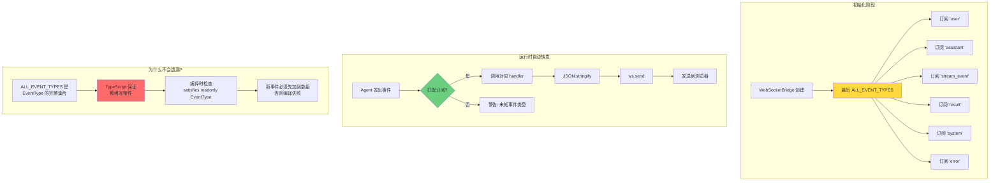
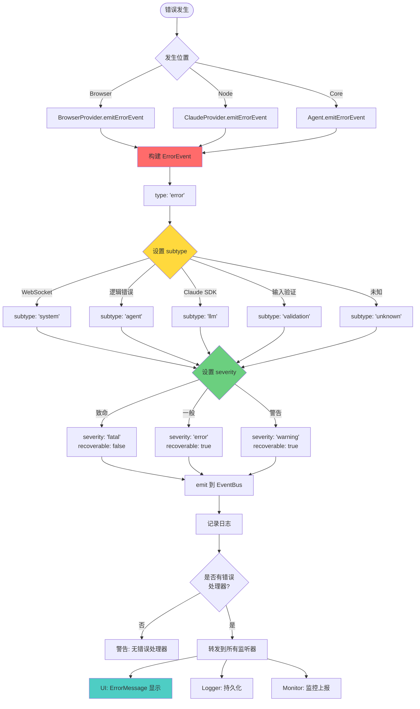
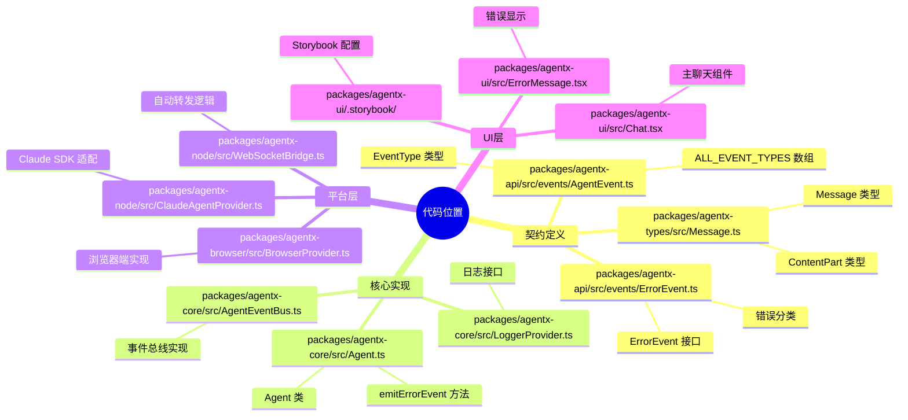

# Deepractice Agent 架构可视化

## 1. 整体架构思维导图

## 2. 包依赖关系图

## 3. 事件总线架构图

```mermaid
graph LR
    subgraph "Browser 端"
        UI[UI Components]
        BAgent[Browser Agent]
        BProvider[BrowserProvider]
        WS_Client[WebSocket Client]
    end

    subgraph "EventBus (RxJS)"
        EB_Browser[Browser EventBus]
        EB_Node[Node EventBus]
    end

    subgraph "Server 端"
        WS_Server[WebSocket Server]
        Bridge[WebSocketBridge]
        NAgent[Node Agent]
        ClaudeProvider[ClaudeAgentProvider]
        SDK[Claude SDK]
    end

    %% Browser side flow
    UI -->|"用户输入"| BAgent
    BAgent -->|"emit event"| EB_Browser
    EB_Browser -->|"forward"| BProvider
    BProvider -->|"send JSON"| WS_Client

    WS_Client <==>|"WebSocket<br/>ws://localhost:5200/ws"| WS_Server

    %% Server side flow
    WS_Server -->|"receive event"| Bridge
    Bridge -->|"emit event"| EB_Node
    EB_Node -->|"forward"| NAgent
    NAgent -->|"send message"| ClaudeProvider
    ClaudeProvider -->|"API call"| SDK

    %% Response flow
    SDK -->|"stream response"| ClaudeProvider
    ClaudeProvider -->|"emit events"| EB_Node
    EB_Node -->|"ALL_EVENT_TYPES<br/>auto subscribe"| Bridge
    Bridge -->|"send JSON"| WS_Server
    WS_Server -->|"push"| WS_Client
    WS_Client -->|"parse event"| BProvider
    BProvider -->|"emit"| EB_Browser
    EB_Browser -->|"notify"| UI

    style EB_Browser fill:#ffd700
    style EB_Node fill:#ffd700
    style WS_Client fill:#ff69b4
    style WS_Server fill:#ff69b4
    style Bridge fill:#87ceeb
```

## 4. 事件类型与数据流

## 5. 完整业务流程图

## 6. 契约优先开发流程

## 7. WebSocketBridge 自动转发机制

## 8. 错误处理流程图

## 9. 学习路径建议

```mermaid
graph LR
    subgraph "第1天: 理解契约"
        D1_1[阅读 agentx-api<br/>所有事件类型]
        D1_2[阅读 agentx-types<br/>消息/内容类型]
        D1_3[理解 ALL_EVENT_TYPES<br/>为什么是单一来源]
        D1_1 --> D1_2 --> D1_3
    end

    subgraph "第2天: 核心逻辑"
        D2_1[agentx-core/Agent.ts<br/>主类实现]
        D2_2[agentx-core/AgentEventBus.ts<br/>事件总线]
        D2_3[agentx-core/LoggerProvider.ts<br/>日志抽象]
        D2_1 --> D2_2 --> D2_3
    end

    subgraph "第3天: 平台适配"
        D3_1[agentx-node<br/>ClaudeProvider]
        D3_2[agentx-node<br/>WebSocketBridge]
        D3_3[agentx-browser<br/>BrowserProvider]
        D3_1 --> D3_2 --> D3_3
    end

    subgraph "第4天: UI 组件"
        D4_1[agentx-ui/Chat.tsx<br/>主组件]
        D4_2[agentx-ui/ErrorMessage.tsx<br/>错误显示]
        D4_3[运行 Storybook<br/>查看所有组件]
        D4_1 --> D4_2 --> D4_3
    end

    subgraph "第5天: 实战调试"
        D5_1[启动 pnpm dev<br/>运行完整应用]
        D5_2[Chrome DevTools<br/>查看 WebSocket]
        D5_3[添加新事件类型<br/>完整流程实践]
        D5_1 --> D5_2 --> D5_3
    end

    D1_3 --> D2_1
    D2_3 --> D3_1
    D3_3 --> D4_1
    D4_3 --> D5_1

    style D1_3 fill:#e1f5ff
    style D2_3 fill:#fff4e1
    style D3_3 fill:#ffe1f0
    style D4_3 fill:#e1ffe1
    style D5_3 fill:#ffd93d
```

## 10. 关键代码位置索引

---

## 使用说明

这些图表都使用 Mermaid 语法,可以在以下环境查看:

1. **GitHub** - 直接在 Markdown 中渲染
2. **VSCode** - 安装 "Markdown Preview Mermaid Support" 插件
3. **在线编辑器** - https://mermaid.live/
4. **Notion/Obsidian** - 支持 Mermaid 代码块

## 推荐学习顺序

1. **思维导图** (整体概览)
2. **包依赖图** (理解模块关系)
3. **业务流程图** (跟踪一次完整对话)
4. **事件总线图** (理解通信机制)
5. **契约开发流程** (掌握开发方法)
6. **错误处理流程** (理解异常处理)
7. **学习路径** (按天学习计划)

祝学习顺利! 🚀
